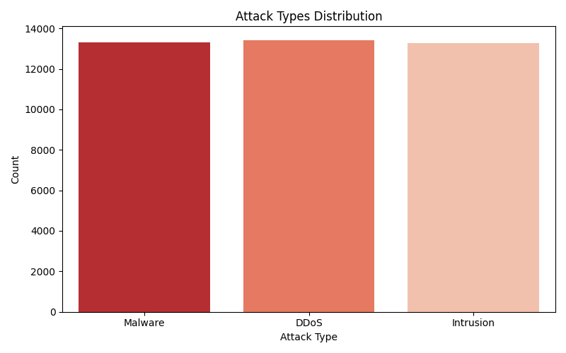
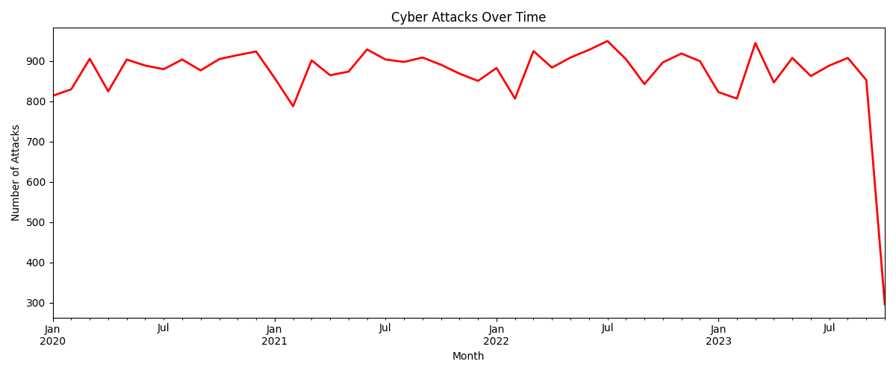

# SOC Threat Monitoring & Analysis System

A data analytics project simulating a Security Operations Center (SOC) dashboard.

## Tools Used
- Python, Pandas, Matplotlib, Seaborn
- Power BI Desktop
- Dataset: Kaggle Cybersecurity Attacks

## What it shows
- Attack type distribution
- Threat severity levels
- Actions taken on threats
- Protocol breakdown
- Network segment targeting
- Attack trends over time

## Screenshots

